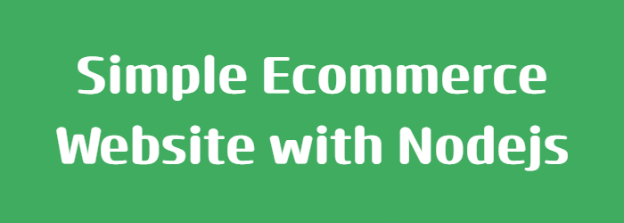
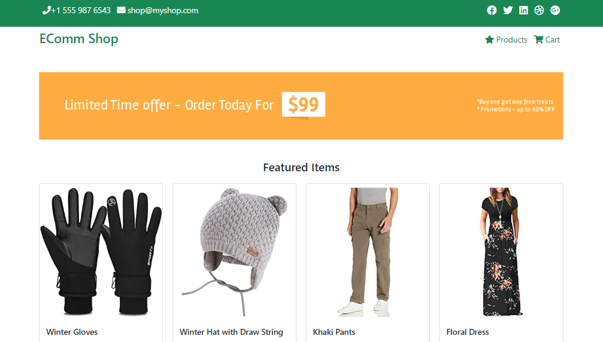
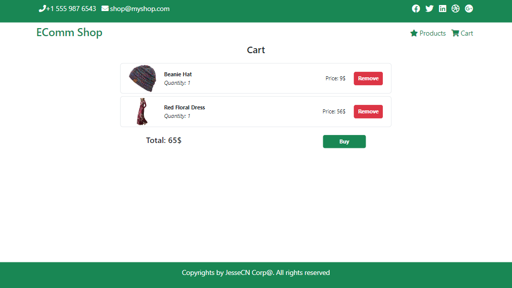
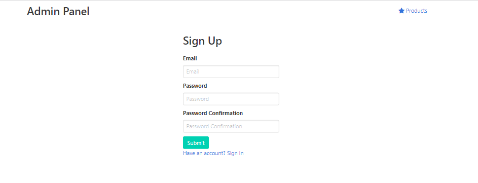
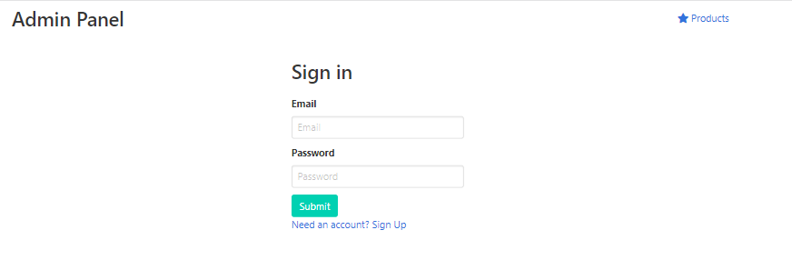
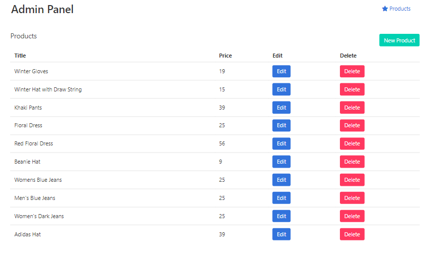
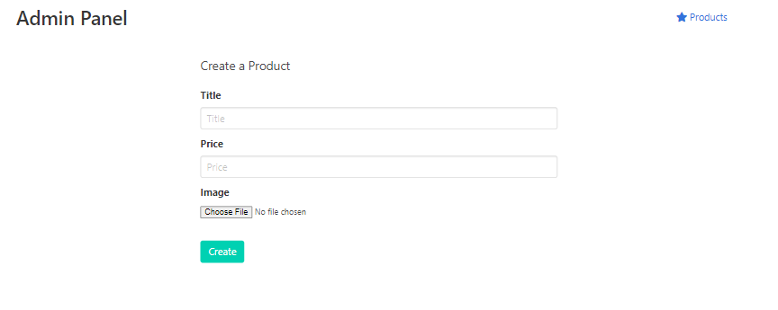
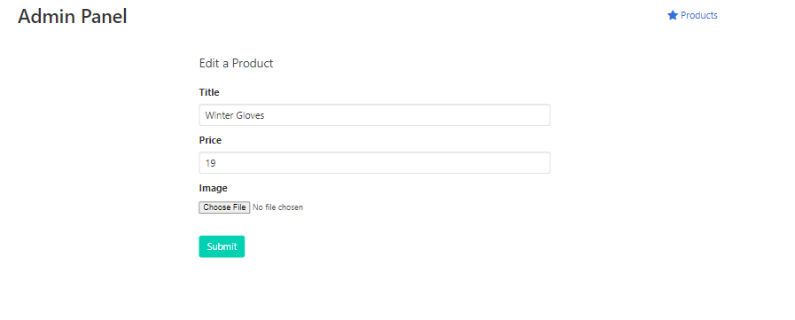

*Started: ... and 5 minutes to read*

# Description
:star: A website contains authorization for admins and users built with NodeJS. For admin role, it contains functionalities: signing in/up/out, see the products list or edit/create a product. For user side, there are features: view product list, add to cart, calculate the total price,... The data is stored in a json file. 

# Features and ScreenShots
## User 
* Main page: include items list, users can choose and add to cart 

* Cart: check for items that are put in cart

## Admin
* Sign Up

* Sign In: the sign in state will be set to **cookies**

* Product list

* Create new product

* Edit product
* 

# Tech Stack
* `NodeJS`: javascript runtime environment
* `ExpressJS`: nodejs framework for building web back-end application, handling routes, dataflow,... .
* Uses of many different **modules, middlewares**
  * `express-session`
  * `express-validator`
  * `body-parser`
  * For repository: `fs, util`
  * Hashing password: `crypto`
* HTML/CSS/Javascript/Boostrap/Bulma

# Installation
1. Clone the repo
2. Ensure that you've installed nodejs, npm
3. Install all dependencies with `npm install` or (`npm i && npm run dev`)
4. In package.json file -> script -> Set `"dev": "node script.js"`
5. Run project in cmd -> `node script.js`

# Contact me at
* Your Name: **Khoa Nguyen**
* Email: nlydkhoa1024@gmail.com
* LinkedIn: https://www.linkedin.com/in/khoa-nguyen-ly/

